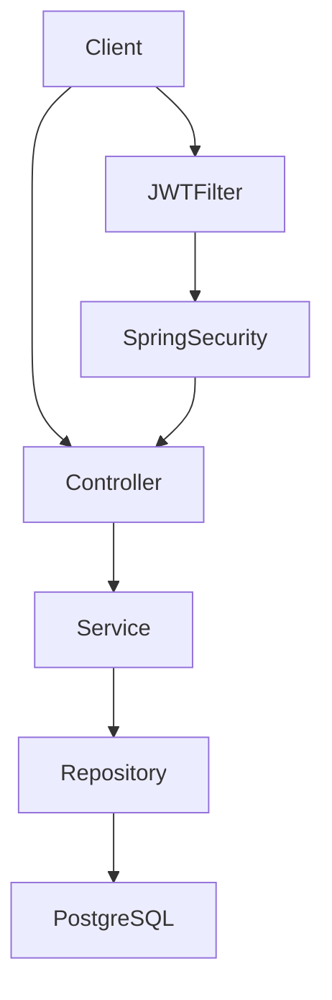

# IT ServiceDesk

A REST-based IT service desk and ticket management backend built with Java and Spring Boot.

The application models a simple internal IT support workflow where employees can create tickets, technicians can process and assign tickets, and administrators have elevated permissions.

## Features

- User registration and login
- Secure password hashing
- JWT-based authentication
- Role-based authorization
- Roles: `EMPLOYEE`, `TECHNICIAN`, `ADMIN`
- Create and retrieve support tickets
- Ticket categories and priorities
- Ticket status workflow
- Automatic ticket creator tracking
- Technician assignment
- PostgreSQL persistence
- Dockerized PostgreSQL environment
- Docker image for the Spring Boot application
- OpenAPI / Swagger documentation
- Automated tests with JUnit and Mockito
- H2 in-memory database for application tests
- GitHub Actions CI pipeline

## Tech Stack

- Java 21
- Spring Boot
- Spring Web
- Spring Security
- Spring Data JPA / Hibernate
- PostgreSQL
- JWT / JJWT
- Maven
- Docker / Docker Compose
- JUnit
- Mockito
- H2
- OpenAPI / Swagger
- GitHub Actions

## Architecture



The application follows a layered architecture:

- **Controller** — REST endpoints and HTTP handling
- **Service** — business logic and transactional operations
- **Repository** — database access through Spring Data JPA
- **Domain** — users, tickets, roles, priorities and statuses
- **Security** — JWT authentication and role-based authorization

## User Roles

### Employee

- Register and log in
- Create tickets
- View tickets

### Technician

- Employee permissions
- Update ticket status
- Assign tickets to technicians

### Admin

- Technician permissions
- Delete tickets

## Ticket Model

Each ticket contains:

- Title
- Description
- Category
- Priority
- Status
- Creator
- Assigned technician
- Creation timestamp
- Update timestamp

### Categories

- `HARDWARE`
- `SOFTWARE`
- `NETWORK`
- `ACCESS`
- `SECURITY`
- `OTHER`

### Priorities

- `LOW`
- `MEDIUM`
- `HIGH`
- `CRITICAL`

### Statuses

- `OPEN`
- `IN_PROGRESS`
- `WAITING`
- `RESOLVED`
- `CLOSED`

## REST API

### Authentication

```http
POST /api/auth/register
POST /api/auth/login
```

### Tickets

```http
POST   /api/tickets
GET    /api/tickets
GET    /api/tickets/{id}
PATCH  /api/tickets/{id}/status?status=RESOLVED
PATCH  /api/tickets/{id}/assign/{userId}
DELETE /api/tickets/{id}
```

Protected endpoints require:

```http
Authorization: Bearer <JWT>
```

## Running Locally

### 1. Start PostgreSQL

```bash
docker compose up -d
```

### 2. Configure JWT secret

PowerShell:

```powershell
$env:JWT_SECRET="your-secure-development-secret"
```

Linux / macOS:

```bash
export JWT_SECRET="your-secure-development-secret"
```

### 3. Start the application

Windows:

```powershell
.\mvnw.cmd spring-boot:run
```

Linux / macOS:

```bash
./mvnw spring-boot:run
```

The API runs at:

```text
http://localhost:8080
```

## Swagger / OpenAPI

After starting the application:

```text
http://localhost:8080/swagger-ui/index.html
```

OpenAPI specification:

```text
http://localhost:8080/v3/api-docs
```

## Running Tests

Windows:

```powershell
.\mvnw.cmd test
```

Linux / macOS:

```bash
./mvnw test
```

Tests run with an isolated H2 in-memory database.

## Docker Image

Build the application image:

```bash
docker build -t it-servicedesk .
```

## Continuous Integration

GitHub Actions automatically runs the Maven test suite on pushes and pull requests to the `main` branch.

## Security

- Passwords are stored using Spring Security password encoding.
- JWT tokens are cryptographically signed and expire after a limited period.
- API access is controlled by user roles.
- JWT secrets are supplied through environment variables and are not committed to the repository.
- Unauthenticated access to protected endpoints returns `401 Unauthorized`.
- Authenticated users without sufficient permissions receive `403 Forbidden`.

## Project Purpose

This project was developed as a personal software engineering portfolio project to demonstrate practical backend development with Java, Spring Boot, REST APIs, authentication, relational databases, testing, Docker and CI/CD.